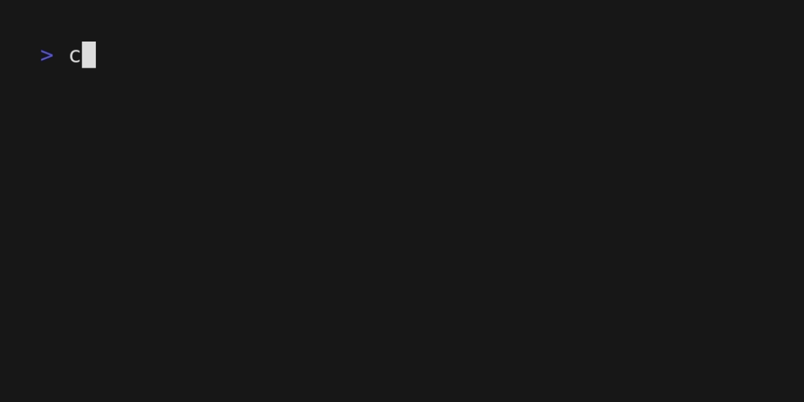

<h1 align=center>cpp-animechan</h1>



## About
`cpp-animechan` is a CLI program to print anime quote to the terminal, written in C++.

## Requirements
- cmake >= 3.10
- c++ 17
- OpenSSL (install with `apt install libssl-dev` on Ubuntu)

## Installation
```bash
git clone https://github.com/laomuon/cpp-animechan.git
cd cpp-animechan
sudo chmod +x install.sh
./install.sh
```

## Usage
```bash
 Usage: cpp-anichan [OPTION 1] [NAME 1] [OPTION 2] [NAME 2] ...
 Without options, a random quote from a random character in a random anime will be printed

 Options:
 -h, --help:
     Print this help menu
 -c, --character [character-name]
     Specify the character for the quote
 -a, --anime [anime-title]
     Specify the anime for the quote
 -b, --bulk
     Print 10 quotes instead of 1

 Examples:
 cpp-anichan -a 'One Punch Man': print a random quote in One Punch Man
 cpp-anichan -c 'Rei Ayanami': print a random quote of Rei Ayanami
 cpp-anichan -c 'Rei Ayanami' -b: print 10 quotes of Rei Ayanami
```

### Acknowledge
- This program uses [Animechan API](https://github.com/rocktimsaikia/animechan) and is heavily inspired by [kug1/aniquote](https://github.com/kug1/aniquote)
- C++ library:
    * [nlohmann/json](https://github.com/nlohmann/json) for json deserializing.
    * [yhirose/cpp-httplib](https://github.com/yhirose/cpp-httplib) for HTTP/HTTPS methods
- [charmbracelet/vhs](https://github.com/charmbracelet/vhs) to generate the terminal GIF
